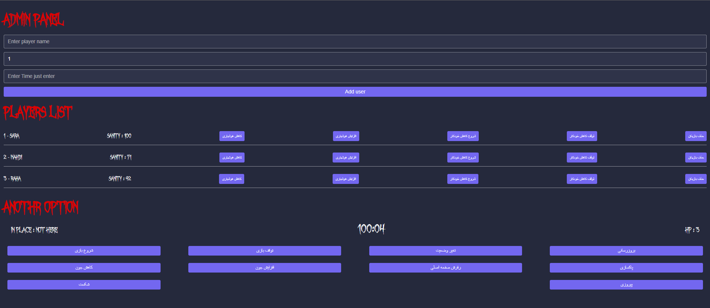
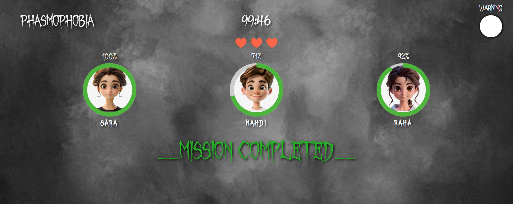

# 👻 Phasmophobia - The Escape Room

**Phasmophobia** is an escape room game with a unique and immersive gameplay experience. The game includes a dedicated **Admin Panel** for game masters and a **Player Dashboard** visible only to participants. Real-time updates, awareness levels, and team-based health mechanics make teamwork and timing essential.

---

## 🧩 Features

- **🔧 Admin Panel**: Full control over the game flow – add/remove players, monitor progress, and manage challenges.
- **🎮 Player Dashboard**: Personalized screen showing each player's **awareness** and the team’s shared **health**.
- **⚡ Awareness System**: Tracks individual player alertness as a percentage. Events and performance impact awareness.
- **❤️ Team Health**: Your team shares 3 lives. Every mistake brings the group closer to game over.
- **⏱ Real-time Synchronization**: All updates are reflected instantly across all connected players.
- **💾 Persistent State**: Using `localStorage` to store player data and progress even after page reloads.
- **🌐 Routing**: Seamless navigation between game pages using React Router.

---


## 📸 Demo

Here’s a quick look at the **Phasmophobia** experience:

### 🧙 Admin Panel



### 🕹 Player Dashboard




## 🚀 Installation & Setup

1. **Clone the repository**:

   ```bash
   git clone https://github.com/aghilsamei/phasmophobia.git
